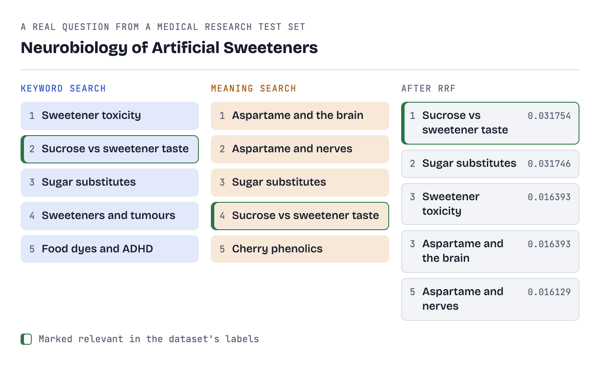
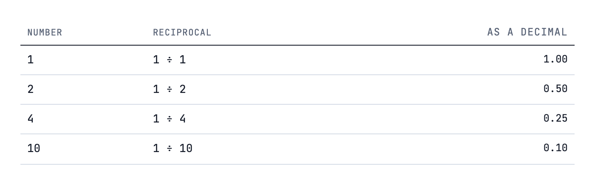
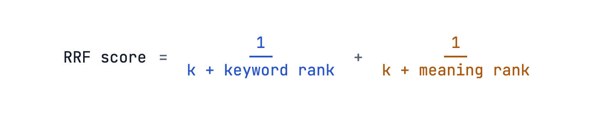
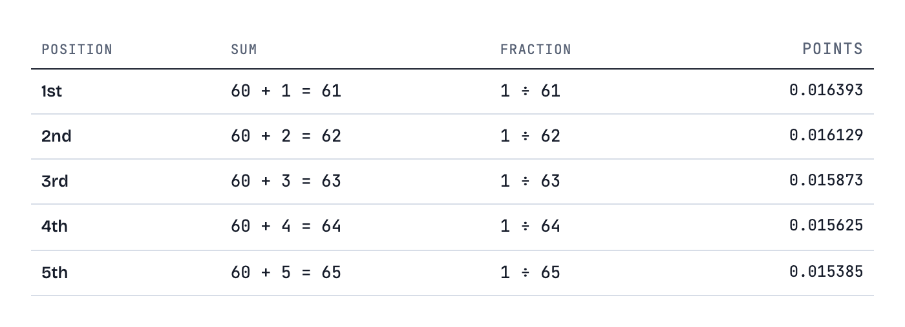
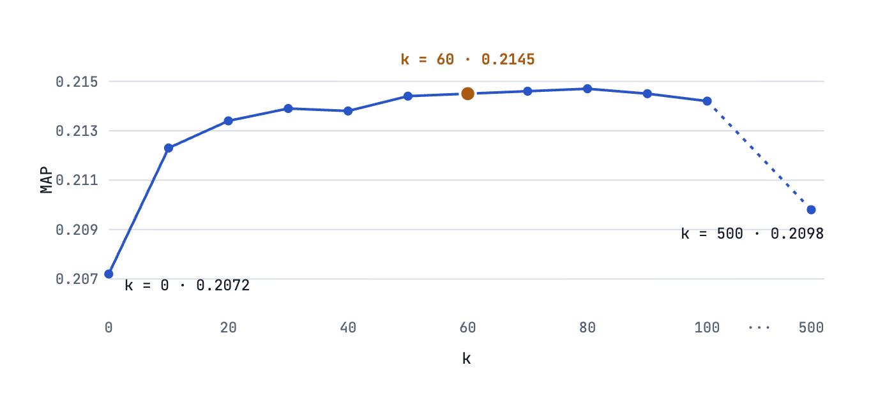
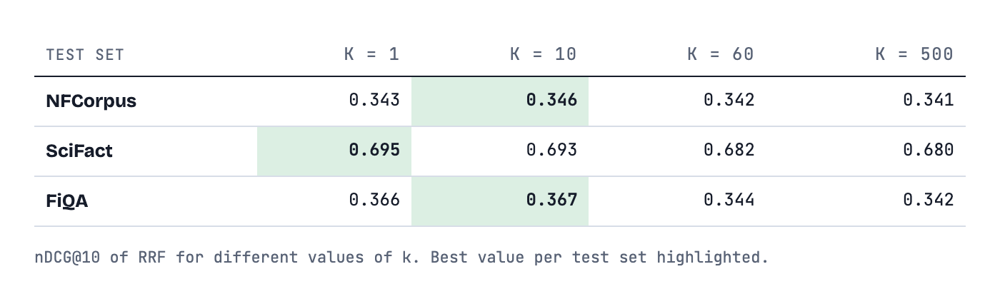

# Reciprocal Rank Fusion, Without the Scary Math

## Two search engines give you two different lists. Here's the simple trick modern hybrid search uses to merge them, using nothing harder than fractions, tested on 1,271 real questions.



*The one relevant paper came 2nd in one list and 4th in the other. RRF moved it to 1st. By the end of Step 3 you'll be able to work out these numbers yourself.*

Say someone types **"cheap flights to Goa"** into a travel site. Behind the scenes, many search systems now ask **two different searchers** at once.

**Keyword search** hunts for the exact words: "cheap", "flights", "Goa". It's precise, but it misses a page titled "Budget airfare to Goa".

**Meaning search** (also called vector or semantic search) looks for pages that *mean* the same thing, so it finds "budget airfare". But it can get vague and miss exact matches.

Each one hands back its own ranked list. Now you have to turn two lists into one.

### Why not just add the scores?

Both searchers do give each result a score. The trouble is, **the scores are on completely different scales**. In the real example below, keyword search (an algorithm called BM25) gives its top result `28.64`. Meaning search gives its top result `0.843`.

Adding those is like adding kilograms to kilometres. The keyword score would drown out the other one every time.

> RRF's big idea: ignore the scores and use only the positions. "1st place" means the same thing in every list.

---

## Step 1: What "reciprocal" means

"Reciprocal" sounds fancy, but it only means **one divided by the number**:



Notice the pattern: **the bigger the number, the smaller its reciprocal.**

That's exactly what a ranking needs. 1st place is a small number, so it gets a big score. 10th place is a bigger number, so it gets a small score.

---

## Step 2: The formula

For each document, you work out one small fraction per list, then add the fractions together. For two lists:



- **rank** is the document's position in that list: 1, 2, 3 and so on.
- **k** is a fixed number, usually **60**. It's explained in Step 4. For now, treat it as "add 60".
- **Missing?** If a document isn't in a list, that list adds **nothing** for it.

With three or four searchers, you'd just keep adding one fraction per list. The document with the **highest total** goes first.

---

## Step 3: Work through a real example

Let's use a real question instead of made-up letters. It comes from **NFCorpus**, a public research test set of 3,633 medical research papers. For each question in it, the dataset already marks which papers are relevant, so we can check whether a ranking is actually good.

The question is **"Neurobiology of artificial sweeteners"**. Three papers in the collection are marked relevant. We ran it through a real search engine ([OpenSearch](https://opensearch.org/) 2.19.1) using both searchers. To keep the sums small, we take just the top 5 from each.

### 3a. What each searcher found


*Raw output from OpenSearch for NFCorpus question PLAIN-2830.*

Three things stand out before we do any maths:

- **The scales don't match.** 28.64 and 0.843 are both "the best result", on completely different scales.
- **Only two papers appear in both lists:** "Sucrose activates human taste pathways" and "Sugar substitutes".
- **The relevant paper is 2nd in one list and 4th in the other.** Neither searcher put it first.

### 3b. Turn positions into points

With k = 60, each position is worth 1 ÷ (60 + position). Because our lists stop at 5th place, there are only five numbers to know:



The points barely change from one position to the next. The totals will be very close, so we keep six decimal places.

### 3c. Add up each paper's points

![Table of RRF totals. Sucrose activates human taste pathways (relevant): 2nd in keyword, 0.016129, plus 4th in meaning, 0.015625, totals 0.031754, final 1st. Sugar substitutes: 3rd plus 3rd, 0.031746, 2nd. The potential toxicity of artificial sweeteners: keyword 1st only, 0.016393, tied 3rd. Effects of aspartame on the brain: meaning 1st only, 0.016393, tied 3rd. Neurologic effects of aspartame: 0.016129, 5th. Sweeteners and urinary tract tumors: 0.015625, 6th. Food dyes and ADHD, and cherry phenolics: 0.015385 each, tied 7th.](images/06-rrf-totals.png)

Final order: the **relevant paper is 1st.** RRF did better than either searcher did alone.

### Agreement beats one star finish

"The potential toxicity of artificial sweeteners" was keyword search's **1st** choice, but it ends up 3rd. The two papers that *both* searchers found collected points twice, so they passed it easily.

### A photo finish

The relevant paper (2nd and 4th) beats "Sugar substitutes" (3rd and 3rd) by just **0.000008**. Being 2nd in one list was worth slightly more than being 3rd, enough to make up for 4th in the other.

### Ties happen

The two papers that came 1st in just one list each have exactly the same score, 0.016393. RRF has no opinion on which goes first, so different systems may list them in either order.

### What nobody finds, RRF never sees

Three papers are marked relevant, but **two of them** didn't make either top 5. RRF can only reorder what the searchers hand it.

One more honest note: NFCorpus labels come from which research papers NutritionFacts.org articles link to, directly or through other articles. So "Effects of aspartame on the brain" counts as not relevant, even though it sounds on-topic.

> RRF rewards the documents that both searchers agree on.

---

## Step 4: So why add 60?

Picture the formula without k, using plain 1 ÷ rank. 1st place scores 1.00 and 2nd place scores 0.50, so **1st gets double the points of 2nd.** One searcher's favourite could win the whole merge on its own.

Adding 60 squashes those gaps. 1 ÷ 61 and 1 ÷ 62 are almost the same number. No single list can take over, so **showing up in several lists** matters more than being #1 in one.


*k decides how much 1st place matters. The "star" is the toxicity paper from Step 3, and the "team player" is "Sugar substitutes".*

So think of k as a **fairness knob**:

- **Small k:** being #1 in any single list matters a lot.
- **Large k:** being #1 matters a little. Agreement across lists matters most.

### Where does 60 come from?

It comes from the paper that introduced RRF: [Cormack, Clarke and Büttcher, SIGIR 2009](https://plg.uwaterloo.ca/~gvcormac/cormacksigir09-rrf.pdf). It wasn't worked out with a formula. The authors picked it in an early small test. In their words, k = 60 *"was fixed during a pilot investigation and not altered during subsequent validation."*

That pilot test combined 30 versions of a search system on a standard research test set (TREC topics 351–400). They measured how good the merged ranking was for different values of k. Their measure is MAP (Mean Average Precision). You don't need the details: **it's a standard score for ranking quality, and higher is better.**



*Source: Table 1 of Cormack et al. (2009). The scale is zoomed in: the whole chart covers less than 0.01 of MAP.*

See how flat the middle is. Any k from about 30 to 100 scores almost the same, and k = 80 actually scored a tiny bit *higher* than 60. Only the extremes are clearly worse. The authors called 60 "near-optimal", and said the exact choice wasn't critical.

Later, search engines copied the paper's value as their default. [Elasticsearch](https://www.elastic.co/docs/reference/elasticsearch/rest-apis/reciprocal-rank-fusion), [OpenSearch](https://docs.opensearch.org/latest/search-plugins/search-pipelines/score-ranker-processor/) and [Azure AI Search](https://learn.microsoft.com/en-us/azure/search/hybrid-search-ranking) all start with 60.

> Watch out for two different "k"s. In vector search, `k` usually means "how many nearest results to fetch". That has nothing to do with RRF's k. OpenSearch avoids the mix-up by calling RRF's k `rank_constant`.

---

## Does RRF actually help?

One question that works out nicely proves nothing. We might have picked a lucky one (we did pick it because it teaches well). To find out properly, we ran the same setup on **1,271 real questions** from three public test sets that come with relevance labels:

- **Engine:** OpenSearch 2.19.1, running in Docker
- **Keyword search:** [BM25](https://en.wikipedia.org/wiki/Okapi_BM25) over each document's title and text
- **Meaning search:** the [all-MiniLM-L6-v2](https://huggingface.co/sentence-transformers/all-MiniLM-L6-v2) embedding model, run in Java with [LangChain4j](https://github.com/langchain4j/langchain4j) and searched with k-NN
- **Data:** NFCorpus, SciFact and FiQA from the [BEIR](https://github.com/beir-cellar/beir) benchmark, 66,454 documents in total
- **Settings:** top 100 results from each searcher, k = 60

To score each ranking we use **nDCG@10**, the standard measure for these test sets. It's a number from 0 to 1 for how good the top 10 results are. A relevant document near the very top counts for more than one at 9th place. **Higher is better**, and 1 would be a perfect top 10.


RRF won on two test sets and **lost on one**. The reason is the most useful thing in this post.

### RRF helps most when both searchers are about equally good

On NFCorpus the two searchers score almost the same (0.307 and 0.315), and RRF beats both by about 9%. On SciFact they're close too (0.656 and 0.624), and RRF wins again. Each searcher finds things the other misses, and RRF gets the best of both.

### It can hurt when one searcher is much weaker

On FiQA, keyword search (0.239) is far behind meaning search (0.363). RRF trusts both lists *equally*, so the weak list pulls good results down. Here you'd have been better off with meaning search alone.

### Averages hide a mix

Even where RRF wins on average, it doesn't win every question. Here is RRF compared with the better single searcher, question by question:


*Number of questions where RRF's top 10 scored higher, the same, or lower than the better single searcher.*

### k = 60 isn't the best choice everywhere

We re-ran the merge with different values of k:



On all three test sets, a **smaller k did better**. On FiQA, k = 10 even edges past meaning search alone (0.367 against 0.363). A small k lets a strong 1st place count for more, which helps when one searcher is clearly better.

**One caution:** we picked these by looking at the test questions themselves, which flatters the result. If you tune k, tune it on your own data.

### You don't need 100 results from each searcher

How many results you take from each list matters too. Taking 10 to 20 did about as well as 100, and sometimes better (FiQA: 0.353 with 20, against 0.344 with 100). Only very short lists hurt: with just 5 from each, NFCorpus drops to 0.317.

### It usually finds more

Looking at the top 100 instead of the top 10, RRF found the largest share of relevant documents on NFCorpus (33% against 31% for meaning search) and SciFact (95% against 93%). On FiQA it roughly tied with meaning search (68.0% against 68.3%). So RRF works well as a first step in systems that re-sort the top results with a slower, smarter model afterwards.

### How we know these numbers are right

- **Against published results:** our keyword scores are close to the [BEIR paper's](https://arxiv.org/abs/2104.08663) BM25 results. NFCorpus: 0.307 against 0.325. SciFact: 0.656 against 0.665. FiQA: 0.239 against 0.236. The small gaps are expected: BEIR used a different engine with word stemming and different BM25 settings.
- **Against OpenSearch itself:** we merged the lists with our own code *and* with OpenSearch's built-in RRF. For every one of the 1,271 questions, the top 10 matched, apart from the order of tied documents like the ones in Step 3.

---

## The whole thing in code

If you write software, here's all of RRF in a few lines of Java. Give it the two top-5 lists from Step 3 and you get exactly the table above.

```java
import java.util.*;

public class Rrf {

    record Scored(String id, double score) {}

    /** Merge ranked lists of doc ids. A doc earns 1 / (k + rank) from every list it appears in. */
    static List<Scored> rrf(List<List<String>> rankedLists, int k) {
        Map<String, Double> scores = new LinkedHashMap<>();
        for (List<String> ranked : rankedLists) {
            for (int i = 0; i < ranked.size(); i++) {
                scores.merge(ranked.get(i), 1.0 / (k + i + 1), Double::sum);
            }
        }
        return scores.entrySet().stream()
                .map(entry -> new Scored(entry.getKey(), entry.getValue()))
                .sorted(Comparator.comparingDouble(Scored::score).reversed())
                .toList();
    }

    public static void main(String[] args) {
        var keyword = List.of("toxicity", "sucrose-taste", "sugar-substitutes", "tumours", "food-dyes");
        var meaning = List.of("aspartame-brain", "aspartame-nerves", "sugar-substitutes", "sucrose-taste", "cherry-phenolics");

        for (Scored doc : rrf(List.of(keyword, meaning), 60)) {
            System.out.printf("%.6f  %s%n", doc.score(), doc.id());
        }
    }
}

// 0.031754  sucrose-taste
// 0.031746  sugar-substitutes
// 0.016393  toxicity
// 0.016393  aspartame-brain
// 0.016129  aspartame-nerves
// 0.015625  tumours
// 0.015385  food-dyes
// 0.015385  cherry-phenolics
```

Notice there's no step to "fix" the scores. RRF never looks at them, which is why it works with any mix of searchers.

In OpenSearch you don't have to write this yourself. You create a search pipeline once, then send hybrid queries through it:

```json
PUT /_search/pipeline/rrf
{
  "phase_results_processors": [
    {
      "score-ranker-processor": {
        "combination": { "technique": "rrf", "rank_constant": 60 }
      }
    }
  ]
}
```

---

## In two sentences

**Give each document a few points for its position in each list (better position, more points), add the points up, and sort. Whatever several searchers agree on rises to the top.**

**It works best when your searchers are about equally good. When one is much weaker, try a smaller k, or check whether the better searcher alone does the job.**

---

## References and further reading

**The original paper**

- G. V. Cormack, C. L. A. Clarke, S. Büttcher. [Reciprocal Rank Fusion outperforms Condorcet and individual Rank Learning Methods](https://plg.uwaterloo.ca/~gvcormac/cormacksigir09-rrf.pdf). SIGIR 2009. [doi:10.1145/1571941.1572114](https://doi.org/10.1145/1571941.1572114). Where RRF and k = 60 come from. It's only two pages.

**The test sets**

- N. Thakur, N. Reimers, A. Rücklé, A. Srivastava, I. Gurevych. [BEIR: A Heterogeneous Benchmark for Zero-shot Evaluation of Information Retrieval Models](https://arxiv.org/abs/2104.08663). NeurIPS 2021 Datasets and Benchmarks. The source of NFCorpus, SciFact and FiQA, and of the published BM25 scores we compared against.
- [beir-cellar/beir on GitHub](https://github.com/beir-cellar/beir): download links and descriptions for every dataset.

**RRF in real search engines**

- [Introducing reciprocal rank fusion for hybrid search](https://opensearch.org/blog/introducing-reciprocal-rank-fusion-hybrid-search/), OpenSearch blog. A friendly walkthrough with diagrams.
- [Score ranker processor](https://docs.opensearch.org/latest/search-plugins/search-pipelines/score-ranker-processor/), OpenSearch documentation.
- [Reciprocal rank fusion](https://www.elastic.co/docs/reference/elasticsearch/rest-apis/reciprocal-rank-fusion), Elasticsearch reference.
- [Hybrid search scoring (RRF)](https://learn.microsoft.com/en-us/azure/search/hybrid-search-ranking), Azure AI Search documentation.

**The building blocks**

- [Okapi BM25](https://en.wikipedia.org/wiki/Okapi_BM25), Wikipedia. How keyword search decides its scores.
- [all-MiniLM-L6-v2](https://huggingface.co/sentence-transformers/all-MiniLM-L6-v2), Hugging Face. The embedding model behind our meaning search.
