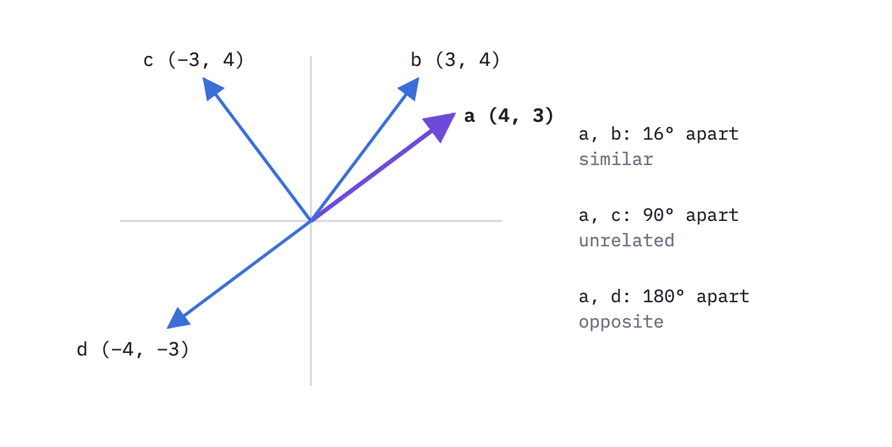
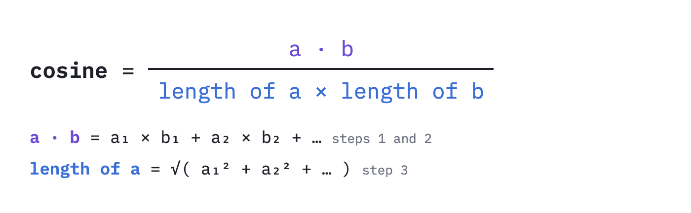
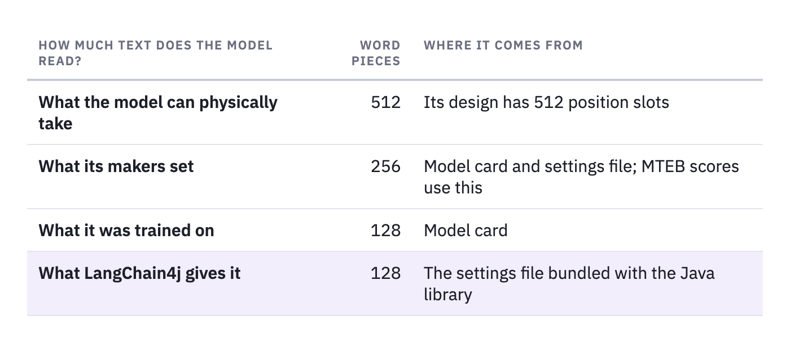

# Semantic Search, Without the Scary Math

## How search by meaning turns words, sentences and paragraphs into arrows of numbers, and when it beats keyword search, tested on 1,271 real questions.


*The same five sentences, ranked by shared words and by meaning. The salt sentence shares no words with the question.*

"Eating less salt helps reduce hypertension" is a good answer to "How can I lower my blood pressure?". It doesn't share a single word with it.

The first part of this series was about keyword search, BM25, which scores a document by the words it has in common with the question. By that measure, the salt sentence scores nothing, and "Lower the tyre pressure before driving on sand" is a match on two words.

Semantic search ranks them the other way round. It scored the salt sentence **0.647** out of 1 and the tyre sentence 0.294. This post shows where those numbers come from, using nothing harder than multiplication, and then tests on 1,271 real questions when searching by meaning beats searching by words.

Every number here was printed by a Java lab you can run yourself; the link is at the end.

---

## Meaning as a direction

Linguists noticed in the 1950s that words with similar meanings turn up in similar company. J. R. Firth's version: "You shall know a word by the company it keeps".

Record that company as a list of numbers and you can draw it as an arrow. With two numbers, (4, 3) means 4 steps right and 3 steps up.



*Similarity is the angle between two arrows. Their length doesn't matter.*

Semantic search does exactly this, with 384 numbers per text instead of 2. Texts that mean similar things get arrows that point in similar directions.

---

## Cosine similarity in four steps

With 384 numbers there's nothing to draw, so the angle has to come from the numbers alone. **Cosine similarity** does that. It turns the angle into a score: 1 for the same direction, 0 for a right angle, −1 for opposite directions.

For a = (4, 3) and b = (3, 4):

- **1. Multiply** the numbers in matching positions: 4 × 3 = 12, and 3 × 4 = 12.
- **2. Add** the results: 12 + 12 = 24. This total is called the **dot product**.
- **3. Measure** each arrow's length, with Pythagoras: √(4² + 3²) = √25 = 5. b is also 5 long.
- **4. Divide** the dot product by both lengths: 24 ÷ 25 = **0.96**.


*Negative numbers do the work. For c, one position agrees and the other disagrees, and they cancel to 0.*

Step 4 is why only direction counts. Take e = (8, 6): it points exactly where a points, but it's twice as long. Its dot product with b is 48, twice a's 24. Dividing by e's length of 10 brings the cosine back to 0.96, the same as a's. Without that step, long arrows would score high against everything.

Written as a formula, for when you meet it elsewhere:



*Steps 1 and 2 are the top of the fraction, step 3 the bottom.*

Real embeddings use the same four steps. For the question and the salt sentence, the first multiplication is −0.0321 × −0.0238, and the second is 0.1206 × 0.1193. After 382 more, the total is 0.6474. No single product matters much. The score is hundreds of small agreements added up.

---

## Words, sentences and paragraphs: one recipe

People talk about "word embeddings", "sentence embeddings" and "document embeddings" as if they were three different things. In a model like the one used here, they're the same thing. Whatever text goes in, one arrow of 384 numbers comes out, made by the same four steps:

- **1. Split** the text into word pieces. Common words are one piece; rarer words are split, so "hypertension" becomes "hyper" + "##tension".
- **2. Start**: every piece gets a starting arrow from a fixed table. It's the same arrow in every sentence. This is all a "word embedding" is.
- **3. Adjust**: every piece looks at every other piece in the text and shifts its arrow to fit. The model repeats this six times.
- **4. Average** all the pieces' arrows into one, and scale it to length 1.

To see step 3 happen, here's a toy version with just two directions, and we can give them names: **money** to the right, **nature and water** up.


*Next to "river" and "water", "bank" swings toward nature. An illustration, not real model output.*


*Same starting arrow for "bank", opposite result.*

In the toy, the two sentences end up with a cosine of 0.46. If you skipped step 3 and averaged the starting arrows, they'd score 0.74, because the shared "bank" would drag them together.

One way to picture step 3: every word is at a meeting. It arrives with its own opinion, listens to everyone else, and shifts its view to fit the conversation. The text's arrow is the room's average view. A **single word** is a meeting of one, so "bank" stays in the middle. A **paragraph** is a bigger meeting: more voices averaged, so if it covers several topics, its arrow sits between them and points clearly at none.

### The real model, measured

The same effects, on the real model's 384 numbers:


*The two "bank" sentences share a word and score lower than the river bank and the stream, which share none.*

### Three things people get wrong

**"A sentence's arrow is the average of its words' arrows."** The words are adjusted by each other first, and only then averaged. If you embed each word on its own and average them, the river-bank and savings-bank sentences score **0.874**, nearly identical. The model's real sentence arrows score **0.262**.

**"A longer text gives a richer arrow."** It gives a more blended one. Every text ends up as 384 numbers however long it is. The parking question scores 0.743 against the parking sentence alone and 0.507 against the paragraph that contains it. That's why search systems split long documents into chunks and embed each chunk separately.

**"Word, sentence and document embeddings are different kinds of thing."** Same model, same 384 numbers, same space. That's what lets a seven-word question be compared directly with a 200-word abstract, which is all semantic search does. Arrows from two *different* models can't be compared at all, though.

---

## Meet the model

Everything here uses one small, free model, **all-MiniLM-L6-v2**, from the Sentence Transformers project. The name says what it is: a MiniLM, Microsoft's compressed version of Google's BERT, with 6 layers (the six rounds of step 3). The Sentence Transformers team trained it on about 1.17 billion pairs of texts that belong together, such as a Stack Exchange question and its accepted answer, or a paper's title and its abstract. Training pulled each pair's arrows together and pushed unrelated texts apart.

It outputs 384 numbers per text, knows 30,522 word pieces, lowercases everything, has about 23 million weights, and runs on a laptop CPU in 8 milliseconds per question.

One detail needs a table of its own, because there are four different answers to "how much text does it read?":



*The last row applies to every search result in this post. More on it below.*

128 word pieces is roughly the first 100 words.

---

## What the arrows capture, and what they miss


*Green rows behave as hoped. Red rows are where meaning search goes wrong.*

The arrows measure "about the same thing", which is close to "means the same thing" but not equal to it. "Hot" and "cold" turn up in the same kinds of sentences, so they sit fairly close. "The dog bit the man" and "The man bit the dog" score 0.978. A 2024 study, [NevIR](https://arxiv.org/abs/2305.07614), found that most retrieval models do no better than chance at telling a document from its negated version. And to the model, order 4471 is just "an order number", while the person searching wants that one order.

---

## Part 1's question, searched by meaning

Part 1 took apart one keyword search on **NFCorpus**, a public test set of 3,633 medical research papers with real questions. Here's the same question, searched both ways:


*Meaning search found two papers on aspartame and the brain that keyword search ranked #24 and #21.*

Keyword search wants "artificial" and "sweeteners", and gets a paper on urinary tract tumours for it. Meaning search puts two papers on aspartame and the brain first: aspartame is an artificial sweetener, and the brain is what neurobiology studies. Neither title shares a word with the question.

The test set doesn't mark them relevant, though, so they earn nothing in the score. Here is how that score is calculated.

### How the score works: nDCG@10

Every result in this post is scored with **nDCG@10**, a number from 0 to 1 for how good the first 10 results are.

- **@10**: only the first 10 results count.
- **Gain**: each relevant result earns points. NFCorpus grades them: a very relevant paper is worth 2 points, a somewhat relevant one 1.
- **Discounted**: points shrink the lower a result appears.
- **Normalised**: the total is divided by the score of a perfect top 10, so the result runs from 0 to 1.


*Both searches found the same paper and missed the same two. Only its position differs.*

So by this question's labels, keyword search wins: 0.403 against 0.275. NFCorpus labels come from which papers a NutritionFacts.org article cited, not from someone judging every paper. One question settles nothing, so next, all of them.

---

## 1,271 questions: keyword against meaning

The same three test sets from the BEIR benchmark as in part 1: **NFCorpus** (medical research), **SciFact** (scientific claims checked against abstracts) and **FiQA** (finance questions answered on a forum). **Recall@100** below is the share of all relevant documents found anywhere in the top 100.


*Green marks the higher score in each row.*

Dataset by dataset:

- **FiQA**: meaning search wins by 0.127 nDCG@10, about half as much again. People ask about money in everyday words and get answered in other everyday words.
- **SciFact**: keyword search wins the top 10 by 0.032. The claims use the abstracts' own technical terms, which is where word matching is strongest.
- **NFCorpus**: about even at the top, but meaning search finds more of the relevant papers in its top 100.

Published results show the same split. In the [BEIR paper](https://arxiv.org/abs/2104.08663), the meaning-search model TAS-B scored 0.319 against BM25's 0.325 on NFCorpus, 0.643 against 0.665 on SciFact, and 0.300 against 0.236 on FiQA.

---

## When meaning search wins

The table suggests a simple explanation: meaning search helps when the question and the answer use different words. We can test that. For every question we measured what share of its words appear in its relevant documents, then grouped the questions by that share.


*Few shared words: meaning search wins. Most words shared: keyword search is hard to beat.*

Four questions from the extremes:

- **"Preventing Cataracts with Diet"**: keyword search matched "preventing" and put "Cranberries for preventing urinary tract infections" first. The relevant paper says "cataract", not "cataracts"; keyword search had it at #86, meaning search at #1.
- **"Hypertension is frequently observed in type 1 diabetes patients."**: the evidence, "Glucose tolerance and blood pressure: long term follow up in middle aged men", talks about blood pressure and glucose tolerance. Keyword search didn't have it in its top 100; meaning search ranked it first.
- **"kohlrabi"**: one rare word. Keyword search found the relevant paper at #1. To the model, kohlrabi is roughly "some plant": it returned a paper on hibiscus and had the relevant one at #18.
- **"Activation of PPM1D suppresses p53 function."**: PPM1D is a gene. Keyword search ranked both relevant papers first and second. Meaning search drifted to p53, the better-known gene, and missed both in its top 10.

Names, codes, gene symbols and rare terms are keyword search's strength and meaning search's weakness. That's why most production systems run both and merge the two lists. Merging is part 3, [Reciprocal Rank Fusion, Without the Scary Math](https://medium.com/jinternals/reciprocal-rank-fusion-without-the-scary-math-68421476c505).

---

## How much of each document the model reads

A model on its own is just a file of numbers. Something has to cut the text into word pieces, feed them in and read the 384 numbers out. In this lab that's **LangChain4j**, a Java library for working with AI models. It ships with its own copy of all-MiniLM-L6-v2 and of the settings file that decides where text is cut.

- **What should happen**: the model can take 512 word pieces, and its makers chose to cut at 256.
- **What happens in LangChain4j**: its settings file cuts every text at 128 pieces, roughly the first 100 words, before the model sees it.
- **How we know**: FiQA's longest document is 3,599 pieces long. Its arrow and the arrow of just its first 126 pieces have a cosine of 1.0000. They're the same arrow.
- **How much it matters**: 97% of NFCorpus papers, 98% of SciFact abstracts and 47% of FiQA answers are longer than 128 pieces.

We found this while checking why our SciFact score was lower than the published one. So we embedded every document twice more: cut at 256, and not cut at all, letting LangChain4j split long texts into parts and average them.


*At 256 pieces, all three match the published scores. The model was fine; the 128 cut was the whole gap.*

Reading more isn't automatically better, though. SciFact's abstracts gained +0.030 from being read in full. NFCorpus and FiQA did slightly worse read in full than at 256 pieces. A whole long document becomes one average of several parts, the blending from the paragraph example, and the model was trained on at most 128 pieces. We didn't measure which of the two matters more.

So check how many word pieces your library actually gives the model, rather than trusting the model card alone, and test the limit on your own data.

---

## Finding the nearest arrows fast

Comparing the question with every document is called exact search. On FiQA that's 57,638 comparisons of 384 numbers each, for every question.

Vector databases skip most of that with an **HNSW** index (Hierarchical Navigable Small World). Each document is linked to a few of its nearest neighbours, in layers: a sparse top layer with long links, and a bottom layer with every document. A search starts at the top, hops to whichever neighbour is closest to the question, drops a layer when no neighbour is closer, and repeats. It's like crossing a country on motorways first and side streets last. It looks at a small fraction of the documents and can occasionally miss a close one.


*HNSW stays near 1 ms as the collection grows. Exact search doesn't.*

HNSW gave the same top 10 as exact search for 1,190 of the 1,271 questions, and cost at most 0.005 nDCG@10. For a few thousand documents, exact search is fine. For millions, it isn't.

---

## Cosine, dot product or distance?

Vector databases make you choose how to compare arrows. OpenSearch offers cosine (`cosinesimil`), dot product (`innerproduct`) and straight-line distance (`l2`).


*Dot product equals cosine here, and distance falls exactly as cosine rises.*

The order never changes, because this model scales every arrow to length 1. Step 4 divides by 1 × 1, so the dot product *is* the cosine. Across all 1,271 questions, the three gave the same top 10 1,271 times out of 1,271. With length-1 arrows, use the dot product; it's the cheapest. With other arrows, use cosine, because the dot product favours long arrows.

---

## In code

With LangChain4j, the model runs inside the Java process, with no server and no API key:

```java
EmbeddingModel model = new AllMiniLmL6V2EmbeddingModel();
float[] vector = model.embed("How can I lower my blood pressure?").content().vector(); // 384 numbers
```

In OpenSearch, the vectors sit in a `knn_vector` field next to the text, so one index serves both keyword and meaning search:

```json
PUT /nfcorpus
{
  "settings": { "index": { "knn": true } },
  "mappings": {
    "properties": {
      "title":     { "type": "text" },
      "text":      { "type": "text" },
      "embedding": {
        "type": "knn_vector", "dimension": 384,
        "method": { "name": "hnsw", "engine": "lucene", "space_type": "cosinesimil" }
      }
    }
  }
}
```

Then search with the question's vector:

```json
POST /nfcorpus/_search
{ "size": 10, "query": { "knn": { "embedding": { "vector": [-0.0321, 0.1206, ...], "k": 10 } } } }
```

---

## Summary

- **An embedding is an arrow of 384 numbers.** Cosine similarity compares directions: multiply, add, divide by the lengths.
- **Words, sentences and paragraphs go through one recipe.** Split into pieces, adjust each piece by its neighbours, average. A longer text gives a more blended arrow, not a richer one.
- **It finds answers written in other words**, and blurs names, numbers, word order and "not".
- **It wins when the answers share few of the question's words**: FiQA +0.127, SciFact −0.032, and 229 questions won to 85 lost when few words are shared.
- **Check how much text your library feeds the model.** Ours gave it 128 word pieces. At 256, our scores match the published ones.
- **HNSW is nearly free**: the same top 10 as exact search for 94% of questions, in about 1 ms.

The next part, [Reciprocal Rank Fusion](https://medium.com/jinternals/reciprocal-rank-fusion-without-the-scary-math-68421476c505), merges keyword search and meaning search into one list.

---

## Run it yourself

The lab is Java 21 with OpenSearch in Docker, in [ai-explained-with-experiments](https://github.com/jinternals/ai-explained-with-experiments/tree/main/SemanticSearch) on GitHub. The first run downloads the three test sets. The model is bundled in LangChain4j, so there's nothing else to install and no API key.

```bash
docker compose run --rm --build lab example     # the worked examples
docker compose run --rm --build lab benchmark   # 1,271 questions, 3 datasets
docker compose run --rm --build lab length      # how much of each document the model reads
```

## Sources

- D. Jurafsky and J. H. Martin, [Speech and Language Processing](https://web.stanford.edu/~jurafsky/slp3/5.pdf), chapter "Embeddings": the distributional hypothesis and cosine similarity.
- T. Mikolov et al., [Efficient Estimation of Word Representations in Vector Space](https://arxiv.org/abs/1301.3781), 2013 (word2vec).
- N. Reimers and I. Gurevych, [Sentence-BERT](https://arxiv.org/abs/1908.10084), EMNLP 2019.
- [sentence-transformers/all-MiniLM-L6-v2](https://huggingface.co/sentence-transformers/all-MiniLM-L6-v2), model card.
- N. Thakur et al., [BEIR](https://arxiv.org/abs/2104.08663), NeurIPS 2021 Datasets and Benchmarks.
- [MTEB results for all-MiniLM-L6-v2](https://github.com/embeddings-benchmark/results/tree/main/results/sentence-transformers__all-MiniLM-L6-v2).
- Y. Malkov and D. Yashunin, [HNSW](https://arxiv.org/abs/1603.09320), IEEE TPAMI 2018.
- O. Weller et al., [NevIR: Negation in Neural Information Retrieval](https://arxiv.org/abs/2305.07614), EACL 2024.
- Spring AI, [Understanding Vectors](https://docs.spring.io/spring-ai/reference/api/vectordbs/understand-vectordbs.html).
