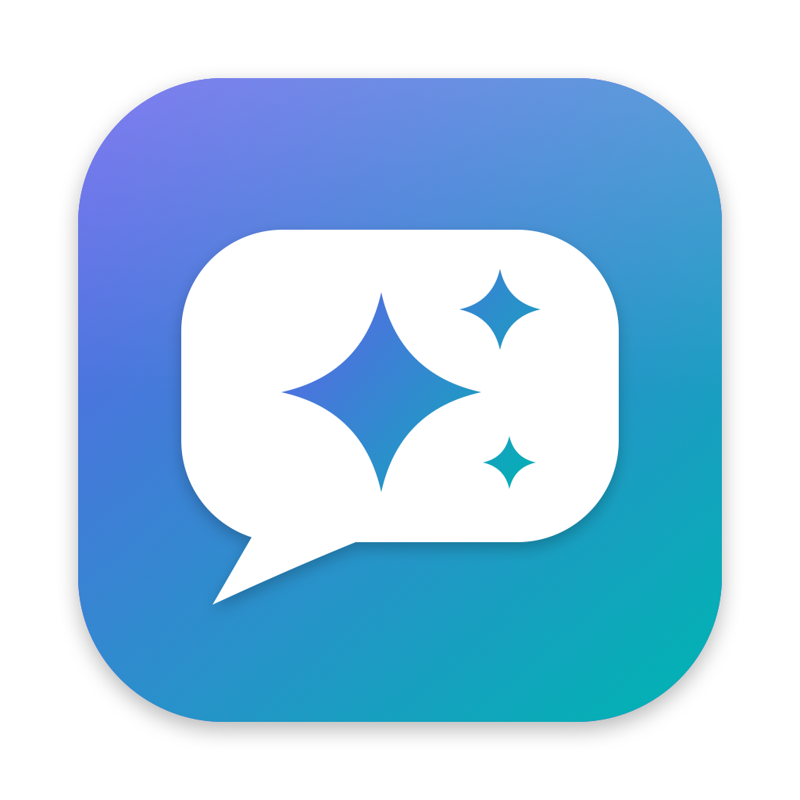

# Apple Foundation Model server



A native macOS menu-bar app that serves Apple's on-device Foundation Model through an **OpenAI-compatible API**, so chat apps such as [Open WebUI](https://github.com/open-webui/open-webui) can use it like any other model.

**App:** `Foundation Model Server.app` · **Base URL:** `http://127.0.0.1:11535/v1` · **Built on:** Apple's [Foundation Models framework](https://developer.apple.com/documentation/foundationmodels)

## The short version

macOS includes a language model that runs entirely on your Mac. Apple only exposes it to Swift code, through the Foundation Models framework. This app wraps it in the API that most chat tools already speak: `GET /v1/models` and `POST /v1/chat/completions`, with streaming. Nothing leaves your Mac, and there are no third-party dependencies.

## Results

Tested on an M4 Pro MacBook Pro with macOS 27:

- The on-device model is available with an 8,192-token context. It answered "What is the capital of Japan?" with "Tokyo is the capital of Japan." (61 prompt tokens, 8 completion tokens).
- Streaming, conversation history, `max_tokens` (`finish_reason: "length"`), `temperature` and `stream_options.include_usage` work with the official OpenAI Python SDK.
- Open WebUI v0.11.4 in Docker (the included `docker-compose.yml`) listed the model, streamed answers, kept conversation history and generated chat titles, reaching the server at `http://host.docker.internal:11535/v1` while it listened only on 127.0.0.1.
- Errors come back in OpenAI's format: a too-long conversation returns `400 context_length_exceeded`, a guardrail refusal returns `400 content_filter`, and an unknown model returns `404 model_not_found`.

## Requirements

- A Mac with Apple silicon and **macOS 27** or later, with **Apple Intelligence turned on** (System Settings → Apple Intelligence & Siri).
- **Xcode 27** to build it.

## Install

**Prebuilt.** [`dist/FoundationModelServer.zip`](dist/FoundationModelServer.zip) holds the app, built for Apple silicon and signed ad hoc. Unzip it and move `Foundation Model Server.app` to your Applications folder. It isn't notarized, so macOS blocks a downloaded copy the first time you open it. Allow it under **System Settings → Privacy & Security → Open Anyway**.

**Or build it yourself:**

```bash
scripts/build-app.sh --install      # builds, signs, and copies it to ~/Applications
open ~/Applications/"Foundation Model Server.app"
```

The app's chat-bubble icon appears in the menu bar (dimmed while the server is stopped). The server starts automatically on port 11535. Click the icon to see its status, copy the base URL, check which models are available, and change settings.

To run just the server in a terminal, without the menu-bar app:

```bash
swift run FoundationModelServer --headless --port 11535            # add --api-key KEY to require a key
```

## Use it with Open WebUI

**Quickest: the included Docker Compose file.** It runs Open WebUI already connected to the app, with no sign-in screen:

```bash
docker compose up -d        # then open http://localhost:3000 and pick apple-on-device
docker compose down         # stop it; chats stay in the open-webui volume
```

If you set an API key in the app, start it with `FOUNDATION_MODEL_API_KEY=yourkey docker compose up -d`. For a shared machine, remove `WEBUI_AUTH=false` from `docker-compose.yml` so Open WebUI asks for accounts.

Tested with Open WebUI v0.11.4: it listed `apple-on-device`, streamed answers, kept the conversation history, and used the model to title chats and suggest follow-ups.

**Or connect an Open WebUI you already run:**

1. Start the app.
2. In Open WebUI, open **Admin Settings → Connections → OpenAI API** and add a connection:
   - **URL:** `http://host.docker.internal:11535/v1` if Open WebUI runs in Docker, or `http://127.0.0.1:11535/v1` if it runs directly on your Mac.
   - **Key:** your API key if you set one in the app, otherwise any text (Open WebUI requires the field).
3. Choose **apple-on-device** in the model picker.

Open WebUI running in Docker on the same Mac works without **Allow other devices on my network**. Turn that on only to reach the server from another computer, and set an API key when you do.

## Logs

Click **Logs** in the menu-bar panel to open the log window. Every request gets one line:

```
2026-09-29 22:27:27.821  INFO     POST /v1/chat/completions 200 · 3879 ms · apple-on-device · not streamed · 1 message · 11 + 18 tokens · stop
2026-09-29 22:27:28.310  INFO     POST /v1/chat/completions 200 · 467 ms · apple-on-device · streamed · 2 messages · 55 + 9 tokens · length
2026-09-29 22:27:28.331  WARNING  POST /v1/chat/completions 404 · 0 ms · Unknown model 'gpt-4o'. Use one of: apple-on-device, apple-private-cloud.
```

- The window can filter by level, search, follow new lines, copy what's shown, and clear.
- **Include message text** adds short previews of each question and answer. It's off by default, because prompts can be private.
- Everything is also appended to `~/Library/Logs/FoundationModelServer/server.log` (the **Log file** button shows it in Finder). Past 5 MB it starts a new file and keeps the previous one as `server.log.1`.
- In headless mode the same lines print to the terminal. Add `--log-messages` for the previews.

## API

| Endpoint | What it does |
|---|---|
| `GET /v1/models` | Lists the models that are available right now |
| `POST /v1/chat/completions` | Chat, streamed (`"stream": true`) or not |
| `GET /health` | Every model with its availability and the reason if it's unavailable |

Supported request fields: `model`, `messages` (system, developer, user, assistant, tool), `stream`, `stream_options.include_usage`, `temperature` (clamped to 0–2), `max_tokens` / `max_completion_tokens`. Other fields are ignored.

```bash
curl http://127.0.0.1:11535/v1/chat/completions -H 'Content-Type: application/json' \
  -d '{"model":"apple-on-device","messages":[{"role":"user","content":"Hello!"}]}'
```

## Models

| Model id | Runs on | Status |
|---|---|---|
| `apple-on-device` | this Mac | Works |
| `apple-private-cloud` | Apple's Private Cloud Compute | Needs an entitlement from Apple (see [Using Private Cloud Compute](#using-private-cloud-compute)) |

## Using Private Cloud Compute

macOS 27 adds a second, larger Apple model that runs on Apple's Private Cloud Compute servers. The app already supports it as `apple-private-cloud`, but Apple only lets apps use it with a **managed entitlement**, `com.apple.developer.private-cloud-compute`. Until your app is signed with it, the model shows as unavailable in the app and in `/health`.

1. **Request access.** Sign in to your Apple Developer account and fill in the [Private Cloud Compute entitlement request](https://developer.apple.com/contact/request/private-cloud-compute/). Apple decides based on eligibility requirements.
2. **Register the app.** When access is granted, go to Certificates, Identifiers & Profiles and register an App ID with an explicit bundle id, for example `com.yourname.FoundationModelServer`. Turn on the Private Cloud Compute capability for it.
3. **Make a provisioning profile.** Create a macOS development profile for that App ID that includes your Apple Development certificate and this Mac, and download it.
4. **Build with it:**
   ```bash
   PROVISIONING_PROFILE=~/Downloads/FoundationModelServer.provisionprofile \
   BUNDLE_ID=com.yourname.FoundationModelServer scripts/build-app.sh --install
   ```
   The script embeds the profile and signs the app with the entitlements in it. It warns if the profile doesn't include Private Cloud Compute.
5. **Use it.** Start the app. `apple-private-cloud` now shows as available, appears in `/v1/models`, and can be picked in Open WebUI.

What changes with Private Cloud Compute: requests leave your Mac and run on Apple's servers, so it needs a network connection; Apple sets a usage quota; and the model is larger than the on-device one. The on-device model keeps working without any of this.

Steps 2 and 3 describe Apple's usual process for managed entitlements. We couldn't try them ourselves, because they only become possible after Apple grants the request. What we did confirm: the entitlement name, and that without it the framework stops the app on the first request, which is why the server checks its own signature before offering the model.

## Layout

```
apple-foundation-model/
├── Sources/FMServerCore/          the server, as a library
├── Sources/FoundationModelServer/ the menu-bar app and --headless mode
├── Tests/FMServerCoreTests/       unit tests (swift test)
├── docker-compose.yml             Open WebUI, connected to the app, for testing
├── Resources/                     the app icon (AppIcon.icns, and a 1024 px PNG)
├── dist/                          the prebuilt app, zipped (FoundationModelServer.zip)
└── scripts/                       build-app.sh builds and signs the .app; make-icon.swift draws the icon
```

| Path | What it is |
|---|---|
| `Sources/FMServerCore/HTTPServer.swift` | A small HTTP/1.1 server on Apple's Network framework, with server-sent events for streaming |
| `Sources/FMServerCore/OpenAI.swift` | The OpenAI request and response types |
| `Sources/FMServerCore/AppleModels.swift` | Turns an OpenAI chat into a Foundation Models transcript and prompt, runs it, and maps errors to OpenAI's format |
| `Sources/FMServerCore/Server.swift` | Routes, API key check, streaming, usage and status counters |
| `Sources/FMServerCore/LogStore.swift` | The log: the last 1,000 lines in memory for the log window, everything in `~/Library/Logs/FoundationModelServer/server.log` |
| `Sources/FoundationModelServer/App.swift` | The menu-bar panel, the log window, settings, `--headless` and `--snapshot` modes |
| `Sources/FoundationModelServer/MenuBarIcon.swift` | The menu-bar icon: the app icon's bubble and sparkles in one colour, dimmed when stopped |
| `scripts/build-app.sh` | Builds `build/Foundation Model Server.app`; `--install` copies it to `~/Applications`, `--dist` zips it into `dist/FoundationModelServer.zip` |
| `scripts/make-icon.swift` | Draws the app icon with Core Graphics and writes `Resources/AppIcon.icns` (`swift scripts/make-icon.swift`) |

## Notes

- **Private Cloud Compute needs Apple's permission.** See [Using Private Cloud Compute](#using-private-cloud-compute). Without the entitlement the framework stops the whole app on the first request instead of returning an error, so the server checks its own signature and lists the model as unavailable until it's present.
- **Text only.** Messages with images or other attachments return `400`. The on-device model reads text.
- **Short context.** The on-device model's context is 8,192 tokens, shared between the conversation and the answer. Long chats will hit `context_length_exceeded`; start a new chat.
- **Usage counts** come from the on-device model's tokenizer, the only one the framework can count with.
- **Guardrails.** Apple's safety guardrails apply. Some inputs, even harmless repetitive text, are refused with `content_filter`.
- **Signing.** `build-app.sh` signs with your Apple Development certificate if you have one, otherwise ad hoc. Either works for the on-device model.
- **The icon is an original drawing.** Apple's license doesn't allow SF Symbols or the Apple logo in app icons, so `make-icon.swift` draws its own chat bubble and sparkle. The menu-bar icon is a one-colour version of the same drawing (`MenuBarIcon.swift`), so macOS tints it for light and dark menu bars.
- **One request per connection.** Every response closes its connection. Chat clients handle this without problems.

## References

- Apple, [Foundation Models framework](https://developer.apple.com/documentation/foundationmodels)
- OpenAI, [Chat Completions API reference](https://platform.openai.com/docs/api-reference/chat)
- [Open WebUI](https://docs.openwebui.com/): OpenAI-compatible connections
